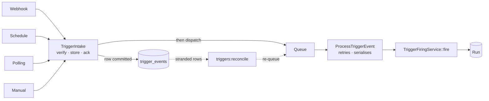
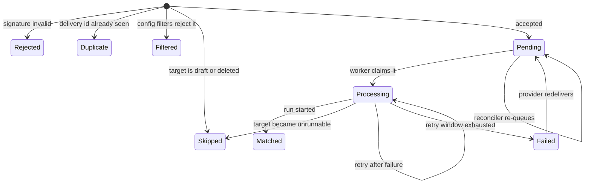

# Triggers

A **trigger** is a saved rule that says: *when X happens, start a run of this workflow or agent.*

This document covers the whole subsystem — the concepts, the data model, every way a
trigger can fire, the guarantees it makes, and how to operate and extend it.

---

## Table of contents

1. [Core idea](#1-core-idea)
2. [Architecture](#2-architecture)
3. [Data model](#3-data-model)
4. [The event lifecycle](#4-the-event-lifecycle)
5. [The four mechanisms](#5-the-four-mechanisms)
6. [Reliability](#6-reliability)
7. [Security](#7-security)
8. [The trigger type catalog](#8-the-trigger-type-catalog)
9. [API reference](#9-api-reference)
10. [Configuration](#10-configuration)
11. [Operations](#11-operations)
12. [Extending the system](#12-extending-the-system)
13. [File map](#13-file-map)
14. [Testing](#14-testing)

---

## 1. Core idea

Two rules explain almost every design decision in this subsystem.

**Rule one: there are four ways in, but one way out.**

However an event arrives — a GitHub webhook, a cron clock, a polled API, a person
clicking Run — it converges on a single method, `TriggerFiringService::fire()`. That is
the only place a run is ever started. Everything else is about getting an event safely
to that method.

**Rule two: write it down first, do the work second.**

Nothing slow happens while a caller is waiting. An inbound event is verified, stored to
the database, and acknowledged — typically in tens of milliseconds. A queue worker picks
it up afterwards and does the actual work, with retries.

That second rule is what makes the system lossless. Retries only help if a job still
exists to retry; committing the row *before* dispatching the job means the event survives
even when the job does not.



---

## 2. Architecture

### Request path (fast, synchronous)

Everything here is CPU and indexed queries only. No model calls, no workflow graphs, no
outbound HTTP.

| Step | Where | Cost |
|---|---|---|
| Look up trigger by token | `WebhookController` | one indexed query |
| Verify signature | `WebhookSignatureVerifier` | HMAC, no I/O |
| Resolve delivery id | `TriggerFiringService::resolveDeliveryId` | header or payload read |
| Dedupe check | `TriggerIntake` | one indexed query |
| Evaluate filters | `TriggerFiringService::matchesFilters` | in-memory array comparison |
| Target runnable? | `TriggerFiringService::isRunnable` | already-eager-loaded relation |
| Insert event row | `TriggerIntake::store` | one insert |
| Dispatch job | `TriggerIntake::dispatch` | one queue push |

Filters are evaluated *at intake* rather than in the worker. This is deliberate: it is
cheap, it means filtered-out events never reach the queue at all, and it means request
headers never need to be persisted for the worker to re-read later.

### Worker path (slow, retryable)

`ProcessTriggerEvent` claims the event, fires it, and settles its status. This is where
a workflow graph gets walked or an agent blocks on a model call.

### Why the split matters

Before this design, an agent webhook held the HTTP request open for the entire model
call. GitHub allows roughly ten seconds before it records a delivery failure; a model
turn regularly takes longer. The provider would time out, retry, and eventually disable
the webhook — while the run had actually succeeded.

---

## 3. Data model

### `trigger_types` — the catalog

Pre-seeded templates a user picks from. Nobody creates these through the API; they ship
with the application via `TriggerTypeSeeder`.

| Column | Purpose |
|---|---|
| `key` | Unique identifier, e.g. `github.push` |
| `category` | Grouping for the UI: `github`, `slack`, `stripe`, `schedule`, … |
| `mechanism` | One of `webhook`, `schedule`, `polling`, `manual` |
| `signature_scheme` | `github`, `stripe`, `slack`, or null |
| `dedupe_header` | Header carrying the provider's delivery id |
| `dedupe_payload_path` | Dot-path to a delivery id inside the payload |
| `preset_config` | Defaults merged *under* the user's config |
| `fields` | Field definitions, enforced at validation time |

The catalog is what lets four GitHub triggers share one webhook implementation — they
differ only by a preset filter.

### `triggers` — what a user creates

| Column | Purpose |
|---|---|
| `triggerable_type` / `triggerable_id` | Polymorphic pointer to a Workflow or Agent |
| `type` | The mechanism, copied from the catalog entry or supplied directly |
| `config` | JSON: cron expression, filters, agent message template |
| `token` | 40-char secret in the webhook URL (webhooks only) |
| `signing_secret` | Encrypted at rest |
| `poll_cursor` | JSON bookmark of the last item processed |
| `consecutive_failure_count` | Circuit breaker counter |
| `is_active` | Every entry point filters on this |
| `last_run_at` | Drives the polling interval check |

### `trigger_events` — the durable inbox

This table is not just an audit log. It is the record of work to be done, and the reason
events survive infrastructure failures.

| Column | Purpose |
|---|---|
| `status` | Lifecycle state — see below |
| `payload` | The decoded payload the worker fires with |
| `payload_snippet` | Raw request body, truncated — forensics for signature debugging |
| `headers` | Allowlisted headers only |
| `delivery_id` | Idempotency key |
| `attempts` | How many times a worker has claimed it |
| `duplicate_count` | How many times the provider redelivered it |
| `run_id` | Set once a run is started |
| `error` | Why it failed, when it did |
| `processed_at` | When it reached a terminal state |

**The unique index on `(trigger_id, delivery_id)` is the single most important
constraint in the system.** It makes deduplication a write-time guarantee rather than a
read-then-write check that two concurrent requests can both pass. NULL delivery ids stay
distinct on every supported driver, so events from sources with no delivery id are never
deduped against each other.

---

## 4. The event lifecycle



| Status | Meaning | Terminal |
|---|---|---|
| `pending` | Stored, waiting for a worker | no |
| `processing` | A worker has it right now | no |
| `matched` | Fired successfully; `run_id` is set | yes |
| `filtered` | Config filters rejected it — not a failure | yes |
| `duplicate` | A retry of an already-accepted delivery | yes |
| `rejected` | Signature verification failed | yes |
| `skipped` | Target was draft, deleted, or the trigger was off | yes |
| `failed` | Every retry exhausted | yes |

`matched` also exists as a **derived boolean accessor** on the model so API consumers
written against the old column keep working. Status is the single source of truth.

---

## 5. The four mechanisms

### 5.1 Webhook

An external service POSTs to a secret URL. The token in the URL *is* the authentication —
GitHub has no way to log in to your application.

```
POST /api/v1/hooks/{token}
```

Intake order, and what each outcome returns:

| Check | Fails → status | HTTP |
|---|---|---|
| Trigger exists, is a webhook, is active | — | `404` |
| Signature valid | `rejected` | `401` |
| Delivery id not already seen | `duplicate` | `200` |
| Config filters match | `filtered` | `200` |
| Target is runnable | `skipped` | `409` |
| Accepted | `pending` | `202` + `event_id` |

**Why duplicates and filtered events return `200`, not an error.** Providers fan an
entire event stream at one URL. GitHub sends pushes, issues, PR activity, and releases
to the same hook. Answering `4xx` to the ones this trigger does not want makes GitHub
retry them, and eventually disable the webhook. `200` means "received, understood,
deliberately doing nothing."

**Signature verification.** Three schemes are implemented in
`WebhookSignatureVerifier`. All use `hash_equals()` rather than `===` — a normal string
comparison bails at the first differing byte, and the timing difference leaks enough to
reconstruct a signature. All hash `$request->getContent()`, the raw body, because
decoding and re-encoding JSON changes whitespace and key order and therefore the hash.

- **GitHub** — `sha256=` + HMAC-SHA256 of the body, in `X-Hub-Signature-256`
- **Stripe** — HMAC of `{timestamp}.{body}`, plus a 300-second freshness window
- **Slack** — HMAC of `v0:{timestamp}:{body}`, plus a 300-second freshness window

The timestamp windows prevent replay: a captured valid request cannot be resent tomorrow.

**Deduplication.** The delivery id comes from `dedupe_header` (GitHub's
`X-GitHub-Delivery`) or `dedupe_payload_path` (Stripe's `id`). Slack sends neither, so it
falls back to a heuristic: an `X-Slack-Retry-Num` header arriving within five minutes of
a matched event is treated as a redelivery.

A redelivery of a **previously failed** event is not ignored — it is re-queued. The
provider resending it is a second chance to get that event through, which is what a
retry is for.

### 5.2 Schedule

`triggers:fire-due-schedule` runs every minute, finds triggers whose cron matches this
exact minute, and queues an event for each.

This command **starts no runs**. It writes rows and returns, so the tick costs the same
whether one trigger is due or a thousand.

Double-firing is prevented by the delivery id, not by locking:

```php
deliveryId: "schedule:{$minute}"   // e.g. schedule:2026-08-05 09:00
```

A second invocation in the same minute collides on the unique index and is recorded as a
duplicate. This holds across concurrent servers, which a per-process check could not.

> **Missed windows are not backfilled.** `isDue()` asks only "does the clock match right
> now". If the scheduler is down at 09:00, the 09:00 run does not happen — it is not
> replayed at 09:05. This is deliberate; backfilling a day of missed crons after an
> outage is usually worse than skipping them.

### 5.3 Polling

For services that offer no webhooks. Two pieces:

- **`triggers:queue-due-polling`** — every minute, decides which triggers are due based
  on `last_run_at + poll_interval_minutes`, and dispatches a `PollTrigger` job.
- **`PollTrigger`** — makes one HTTP call, and queues an event per new item.

`PollTrigger` implements `ShouldBeUnique` with `uniqueFor = 120`, so a slow poll still
in flight when the next tick fires cannot have a second job queued behind it racing on
the cursor.

Each item's own cursor value becomes its idempotency key:

```php
deliveryId: 'poll:'.$cursorValue
```

This gives a strong property: **if the job dies mid-loop, nothing is lost and nothing is
duplicated.** Items already queued collide with their own delivery ids on the next poll;
items not yet reached are simply picked up. The cursor is advanced per item rather than
after the loop for the same reason.

A polling trigger type needs three keys in `preset_config`:

| Key | Meaning |
|---|---|
| `poll_url` | The URL to fetch |
| `items_path` | Dot-path to the array of items in the response |
| `cursor_path` | Dot-path to each item's ordering value |
| `poll_interval_minutes` | Optional; falls back to config default |

> **Note:** no polling entries ship in the seeded catalog. Polling works, and is covered
> by tests, but using it means creating a `trigger_types` row with the keys above.

Outbound authentication comes from an attached `Credential` — bearer token, basic auth,
or an API key header. Expired credentials throw before the request is made.

### 5.4 Manual

A person clicks Run.

```
POST /workspaces/{workspace}/workflows/{workflow}/triggers/{trigger}/run
POST /workspaces/{workspace}/agents/{agent}/triggers/{trigger}/run
```

This is the one path that still checks `hasInFlightRun()` synchronously and returns
`409` if the target is busy. That is a UI affordance — a person double-clicking Run
should be told the target is busy. The automated paths deliberately do **not** do this,
because there it silently discarded events.

---

## 6. Reliability

### What each failure mode costs

| Failure | What happens |
|---|---|
| Provider sends a duplicate | Unique index rejects it; counted on the original row |
| Two deliveries arrive simultaneously | One wins the insert; the other is folded into it |
| Config filters reject the event | Recorded as `filtered`, never queued, `200` returned |
| Target is a draft or deleted | Recorded as `skipped` at intake, `409`, never queued |
| Run throws | Job retries with backoff `5s → 15s → 60s` |
| Retry window exhausted | Event `failed`, trigger's failure streak advances |
| Another event for the same trigger is running | Released back to the queue, retried shortly |
| Queue dispatch fails (Redis down) | Row already committed; reconciler re-queues it |
| Worker killed mid-run | Row stuck at `processing`; reconciler re-queues it |
| Poll job killed mid-loop | Queued items dedupe; unreached items picked up next poll |
| Scheduler runs twice in a minute | Minute-keyed delivery id makes the second a duplicate |
| Target permanently broken | Circuit breaker deactivates the trigger after N failures |

### Retry policy

`ProcessTriggerEvent` is bounded by **time**, not attempt count:

```php
public int $maxExceptions = 3;
public function retryUntil(): DateTimeInterface   // default 30 minutes
public function backoff(): array { return [5, 15, 60]; }
```

The reason: `WithoutOverlapping` releases a job back onto the queue when a sibling event
for the same trigger is in flight, and **a released job burns an attempt**. A count-based
limit would expire a busy trigger's events without them ever having been tried.
`maxExceptions` bounds the thing that actually matters — real failures.

### Concurrency

Events for the same trigger are serialised by `WithoutOverlapping`, keyed on the trigger
id, with `releaseAfter`. An event that arrives while another is running **waits and then
runs**, rather than being discarded.

### Idempotency

Two independent guards, so at-least-once queue delivery is safe:

1. The unique index stops a second row existing for a delivery.
2. `TriggerEvent::claim()` is a conditional update that only succeeds for a non-terminal
   event. A re-dispatched or duplicated job for an already-settled event is a no-op.

### The circuit breaker

`Trigger::registerFailure()` increments `consecutive_failure_count` and deactivates the
trigger once it reaches `triggers.max_consecutive_failures` (default 5). A success resets
it to zero — it is a *consecutive* count.

Two refinements matter:

- Failures are counted **when an event is permanently given up on**, not per attempt. One
  flaky event retried three times is one failure, not three.
- An event that expired **without ever being claimed** does not count at all. That is
  queue contention, and says nothing about whether the target is healthy.

### The reconciler

`triggers:reconcile` runs every five minutes and re-queues events stranded in a
non-terminal state past their grace period:

- `pending` older than `reconcile.pending_after_minutes` (default 5)
- `processing` not updated for `reconcile.processing_after_minutes` (default 15)

Stale `processing` rows are reset to `pending` first, because `claim()` cannot
distinguish a stale claim from a live one otherwise. Events whose trigger has since been
deleted or deactivated are settled as `skipped` rather than re-queued.

This is the piece that turns "we retry failures" into "nothing is lost."

### What is *not* guaranteed

Being honest about the boundary: if a provider never reaches your server — DNS failure,
network partition, your load balancer returning 502 — no design here helps. The
guarantee is that **once a request is accepted, the event is not lost.** Cron windows
missed during downtime are also not backfilled, as described above.

---

## 7. Security

| Concern | Mechanism |
|---|---|
| Who may call the hook URL | 40-char random token, unique-indexed |
| Payload authenticity | HMAC signature verification, opt-in per trigger type |
| Replay attacks | 300-second timestamp windows (Stripe, Slack) |
| Timing attacks | `hash_equals()` for every comparison |
| Secret storage | `signing_secret` cast to `encrypted` |
| Abuse | Rate limiter keyed on the token, default 60/min |
| Secret leakage into logs | Header **allowlist**, never a blocklist |
| Dedupe-slot squatting | Rejected deliveries stored with a null delivery id |

That last row is subtle and worth stating plainly. If a signature-rejected delivery
consumed its delivery id, an attacker who guessed a delivery id could send a badly signed
request first and permanently block the legitimate one. Rejected events are stored
without their delivery id so this cannot happen.

The header allowlist in `TriggerIntake::ALLOWED_HEADERS` is an allowlist by design: a
blocklist means every newly invented sensitive header leaks by default.

### Permissions

| Permission | Grants | Minimum role |
|---|---|---|
| `trigger.view` | List triggers | Viewer |
| `trigger-event.view` | Read the event log | Viewer |
| `trigger.run` | Fire a trigger manually | Member |
| `trigger.manage` | Create, update, delete | Editor |
| `trigger.token.rotate` | Rotate a webhook token | Admin |

Rotating a token invalidates the old URL immediately without touching event history.

---

## 8. The trigger type catalog

Nineteen entries ship in `TriggerTypeSeeder`, across seven categories.

| Category | Keys | Mechanism | Signed | Deduped by |
|---|---|---|---|---|
| Schedule | `schedule.hourly`, `.daily`, `.weekly`, `.monthly`, `.cron` | schedule | — | due minute |
| Manual | `manual.run` | manual | — | — |
| Webhook | `webhook.custom` | webhook | — | — |
| GitHub | `github.push`, `.pull_request`, `.issue`, `.release` | webhook | github | `X-GitHub-Delivery` |
| Slack | `slack.message`, `.app_mention`, `.reaction_added` | webhook | slack | retry-num heuristic |
| Stripe | `stripe.charge_succeeded`, `.invoice_created`, `.customer_created` | webhook | stripe | payload `id` |
| Discord | `discord.message`, `.reaction` | webhook | — | — |

Every provider entry is a webhook plus a preset filter. For example `github.push`:

```php
'preset_config' => ['filters' => [
    ['source' => 'header', 'path' => 'X-GitHub-Event', 'operator' => 'equals', 'value' => 'push'],
]]
```

### Filters

Filters are ANDed — all must match, and a trigger with no filters always matches.

| Field | Values |
|---|---|
| `source` | `payload` or `header` |
| `path` | Dot-path into the payload, or a header name |
| `operator` | `equals`, `not_equals`, `contains` |
| `value` | String to compare against |

### Config merging

`TriggerType::buildConfig()` merges preset under user config:

```php
array_replace_recursive($this->preset_config ?? [], $userConfig)
```

**The user's values win.** "Daily at 09:00" can be overridden to 17:00 while every other
preset key survives.

---

## 9. API reference

All management routes are nested under a workspace and require `auth:api` + `verified`,
plus the `workspace.context` middleware which resolves the workspace and the caller's
role before any controller runs.

### Public

| Method | Path | Auth |
|---|---|---|
| `POST` | `/api/v1/hooks/{token}` | The token itself |

Responses: `202` `{event_id}` accepted · `200` duplicate or filtered · `401` bad
signature · `404` unknown token · `409` target not runnable.

### Catalog

| Method | Path |
|---|---|
| `GET` | `/api/v1/trigger-types` |

### Management

Available under both `workflows/{workflow}` and `agents/{agent}`:

| Method | Path | Permission |
|---|---|---|
| `GET` | `…/triggers` | `trigger.view` |
| `POST` | `…/triggers` | `trigger.manage` |
| `PUT` | `…/triggers/{trigger}` | `trigger.manage` |
| `DELETE` | `…/triggers/{trigger}` | `trigger.manage` |
| `POST` | `…/triggers/{trigger}/run` | `trigger.run` |
| `POST` | `…/triggers/{trigger}/rotate-token` | `trigger.token.rotate` |
| `GET` | `…/triggers/{trigger}/events` | `trigger-event.view` |

### Creating a trigger

```jsonc
POST /api/v1/workspaces/1/agents/5/triggers
{
  "trigger_type_key": "github.push",   // or "type": "webhook"
  "signing_secret": "whsec_...",       // required if the type is signed
  "config": {
    "message": "Summarise this push: {{ input.head_commit.message }}"
  }
}
```

Returns `201` with the trigger, including `webhook_url` when applicable.

### Reading outcomes

Since firing is asynchronous, `event_id` is what you get back — not `run_id`. Poll the
events endpoint to follow it:

```jsonc
{
  "id": 91,
  "status": "matched",
  "matched": true,
  "run_id": 42,
  "attempts": 1,
  "duplicate_count": 0,
  "error": null,
  "processed_at": "2026-08-05T09:00:01Z"
}
```

---

## 10. Configuration

`config/triggers.php`:

| Key | Env | Default | Meaning |
|---|---|---|---|
| `max_consecutive_failures` | `TRIGGERS_MAX_CONSECUTIVE_FAILURES` | 5 | Failures before a trigger deactivates |
| `default_poll_interval_minutes` | `TRIGGERS_DEFAULT_POLL_INTERVAL_MINUTES` | 5 | Fallback poll interval |
| `hook_rate_limit_per_minute` | `TRIGGERS_HOOK_RATE_LIMIT_PER_MINUTE` | 60 | Per-token webhook rate limit |
| `queues.default` | `TRIGGERS_QUEUE` | `triggers` | Queue for workflow events |
| `queues.agent` | `TRIGGERS_AGENT_QUEUE` | `triggers-agent` | Queue for agent events |
| `processing.retry_window_minutes` | `TRIGGERS_RETRY_WINDOW_MINUTES` | 30 | How long one event may keep retrying |
| `processing.overlap_release_seconds` | `TRIGGERS_OVERLAP_RELEASE_SECONDS` | 10 | Wait when a sibling event is in flight |
| `reconcile.pending_after_minutes` | `TRIGGERS_RECONCILE_PENDING_MINUTES` | 5 | Grace period for `pending` |
| `reconcile.processing_after_minutes` | `TRIGGERS_RECONCILE_PROCESSING_MINUTES` | 15 | Grace period for `processing` |
| `reconcile.batch` | `TRIGGERS_RECONCILE_BATCH` | 500 | Max events re-queued per run |

> Both reconcile grace periods must comfortably exceed normal processing time, or the
> reconciler will race live work and re-queue events that are simply still running.

---

## 11. Operations

### Deploying this system

1. **`php artisan migrate`** — adds the status/payload/attempts columns, backfills
   existing history, drops the old `matched` column, and creates the unique index.
2. **`php artisan db:seed --class=TriggerTypeSeeder`** — idempotent; safe to re-run.
3. **Restart Horizon** — two new supervisors must start, or accepted events sit at
   `pending` forever with nothing to work them.

### Queues

| Queue | Supervisor | Worker timeout | Why |
|---|---|---|---|
| `default` | `supervisor-1` | 60s | Everything else |
| `triggers` | `supervisor-triggers` | 120s | Workflow trigger events |
| `triggers-agent` | `supervisor-triggers-agent` | 360s | Agent events block on a model call |

Agent events get their own lane because they are slow by nature. Without the split, one
agent waiting on a model would hold a worker that workflow events need.

The agent supervisor's worker timeout (360s) deliberately exceeds
`ProcessTriggerEvent::$timeout` (300s). If the worker timeout were lower, it would kill
the job before the job's own retry handling ever got a say.

### Scheduled commands

| Command | Frequency | Does |
|---|---|---|
| `triggers:fire-due-schedule` | every minute | Queues events for due cron triggers |
| `triggers:queue-due-polling` | every minute | Dispatches poll jobs for due triggers |
| `triggers:reconcile` | every 5 minutes | Re-queues stranded events |

All three use `withoutOverlapping()` and `onOneServer()`.

### Monitoring

The queries that tell you whether the system is healthy:

```sql
-- Backlog. Should be near zero.
SELECT status, COUNT(*) FROM trigger_events
WHERE status IN ('pending','processing') GROUP BY status;

-- Anything the reconciler will pick up.
SELECT COUNT(*) FROM trigger_events
WHERE status = 'pending' AND created_at < NOW() - INTERVAL 5 MINUTE;

-- Triggers the circuit breaker has switched off.
SELECT id, triggerable_type, triggerable_id, consecutive_failure_count
FROM triggers WHERE is_active = 0 AND consecutive_failure_count > 0;

-- Recent failures, most common first.
SELECT error, COUNT(*) FROM trigger_events
WHERE status = 'failed' AND created_at > NOW() - INTERVAL 1 DAY
GROUP BY error ORDER BY 2 DESC;
```

A healthy system has a near-empty backlog, a reconciler that reports zero, and no
unexplained deactivated triggers.

### Troubleshooting

| Symptom | Likely cause |
|---|---|
| Events stuck at `pending` | No worker on the `triggers` / `triggers-agent` queue |
| Trigger went inactive by itself | Circuit breaker; check `error` on recent events |
| Provider reports delivery failures | Check for `rejected` events — signature mismatch |
| Webhook returns 200 but nothing runs | Events are `filtered`; check the trigger's filters |
| Webhook returns 409 | Target workflow is a draft, or the target was deleted |
| Same run happening twice | Delivery id is not resolving — check `dedupe_header` |
| Reconciler re-queues live work | Grace periods set below actual processing time |

The event log is the first place to look for all of these — every attempt leaves a row
with a status and an error, including the ones that deliberately did nothing.

---

## 12. Extending the system

### Adding a provider

Most new providers need **no new code** — one array in `TriggerTypeSeeder::catalog()`:

```php
['category' => 'gitlab', 'key' => 'gitlab.push', 'name' => 'GitLab: On Push',
    'mechanism' => 'webhook',
    'description' => 'Fires when commits are pushed.',
    'dedupe_header' => 'X-Gitlab-Event-UUID',
    'preset_config' => ['filters' => [
        ['source' => 'header', 'path' => 'X-Gitlab-Event', 'operator' => 'equals', 'value' => 'Push Hook'],
    ]],
    'fields' => []],
```

### Adding a signature scheme

Only if the provider signs differently from GitHub, Stripe, or Slack. Add a private
method to `WebhookSignatureVerifier` and an arm to its `match`. Use `hash_equals()` and
`$request->getContent()`, and include a timestamp window if the provider sends one.

### Adding a filter operator

Add an arm to the `match` in `TriggerFiringService::matchesFilters()` and the
corresponding `Rule::in` in `StoreTriggerRequest`.

### Adding a new target type

Currently a trigger targets a Workflow or an Agent. A third would need:

1. An arm in `TriggerFiringService::fire()`
2. A matching `isRunnable*()` predicate
3. A queue decision in `TriggerIntake::queueFor()` if it has different timing behaviour

---

## 13. File map

```
app/
  Enums/Triggers/
    TriggerEventStatus.php            Event lifecycle states
  Models/Triggers/
    Trigger.php                       The rule; circuit breaker lives here
    TriggerType.php                   Catalog entry; config merging
    TriggerEvent.php                  Inbox row; claim() and status transitions
  Services/Triggers/
    TriggerIntake.php                 Single write path; accept/reject/dispatch
    TriggerIntakeResult.php           Outcome + row, kept distinct
    TriggerFiringService.php          The one place a run is started
    TriggerBuilder.php                Creates triggers from catalog entries
    WebhookSignatureVerifier.php      GitHub / Stripe / Slack HMAC
  Jobs/Triggers/
    ProcessTriggerEvent.php           Fires one event, with retries
    PollTrigger.php                   Fetches a source, queues an event per item
  Console/Commands/
    FireDueScheduleTriggersCommand.php    Cron → events
    QueueDuePollingTriggersCommand.php    Interval → poll jobs
    ReconcileTriggerEventsCommand.php     Recovers stranded events
  Http/
    Controllers/Api/V1/Triggers/
      WebhookController.php           Public endpoint; verify, store, ack
      AgentTriggerController.php      Agent-scoped CRUD
      WorkflowTriggerController.php   Workflow-scoped CRUD
      TriggerEventController.php      Event log
      TriggerTypeController.php       Catalog
      Concerns/HasTriggerActions.php  Shared CRUD body
    Requests/Api/V1/Triggers/         Validation, incl. catalog field enforcement
    Resources/V1/Triggers/            API serialisation
config/
  triggers.php                        All tunables
  horizon.php                         Queue supervisors
database/
  migrations/…create_trigger_types_table.php
  migrations/…create_triggers_table.php
  migrations/…create_trigger_events_table.php
  migrations/…restructure_trigger_events_for_async_processing.php
  seeders/TriggerTypeSeeder.php       The 19 catalog entries
routes/
  api.php                             Public hook route
  api/agents.php, api/workflows.php   Nested management routes
  console.php                         The three scheduled commands
```

---

## 14. Testing

```bash
php artisan test --compact tests/Feature/Triggers
```

| File | Covers |
|---|---|
| `TriggerTest.php` | Creation, validation, webhook firing |
| `AgentTriggerTest.php` | Agent targets, message templates |
| `TriggerIntakeTest.php` | Store-before-dispatch, queue routing, dedupe counting |
| `TriggerReconcileTest.php` | Stranded event recovery, grace periods, no double runs |
| `WebhookSignatureTest.php` | All three signature schemes |
| `WebhookDedupeTest.php` | Provider redelivery for each dedupe strategy |
| `TriggerFailureCircuitBreakerTest.php` | Failure counting semantics |
| `PollingTriggerTest.php` | Cursor advance, interval due-check |
| `TriggerEventLogTest.php` | Event log recording and access control |
| `TriggerCatalogTest.php` | Preset merging, field enforcement |
| `TriggerRateLimitTest.php` | Per-token isolation |
| `ManualTriggerRunTest.php` | Manual runs, in-flight 409 |
| `RotateTriggerTokenTest.php` | Token rotation preserves history |
| `UpdateTriggerTest.php` | Updates and ownership checks |

Tests run with `QUEUE_CONNECTION=sync`, so a dispatched job executes inline. Tests that
need to assert queue behaviour rather than run outcomes use `Queue::fake()`.
